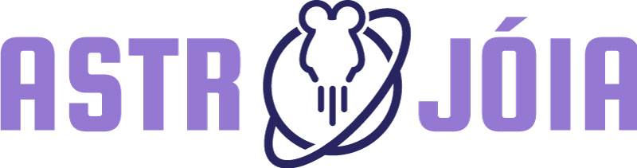

# Astrojoia (Viktor 1 mission)

## Objectives

* ascend to 20-30km altitude
* video record the entire flight
* measure internal temperature

## Materials

* raspberry pi zero
* radio transmitter (Radiometrix HX1 144.8mhz)
* gps receiver (uBLOX MAX-M8C Pico)
* 3300mah lithium ion batterie 18650
* DHT22 temperature sensor module
* Raspberry Pi camera V2 (with infrared filter)

## Case production

* **material**: styrofoam (esferovite)
* cut wall with a router (designar) with holes for 3d printed rods (+structural strength)
* glue wall with internal rods

## Important topics

* in theory it is necessary to have a license to operate a radio on aprs frequency 
* in theory 10km is the max range of Radiometrix HX1 radio
* it is necessary to encode messages (modulation/demodulation) and send them on APRS frequency
